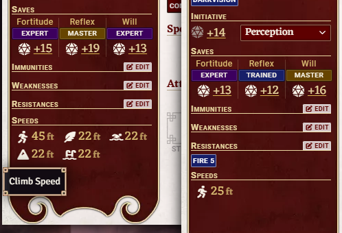

A FoundryVTT module for the Pathfinder 2e system. Adds a compact "Speeds" block to the always-visible sidebar of every player character sheet, listing Land, Fly, Swim, Climb, and Burrow speeds (whichever the character has) so they remain visible regardless of which sheet tab is active.

Tested and released under FoundryVTT 14 with the PF2e system.
